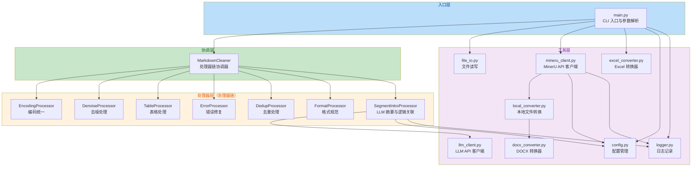
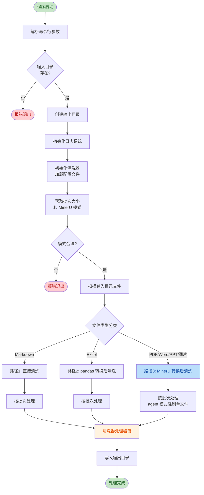
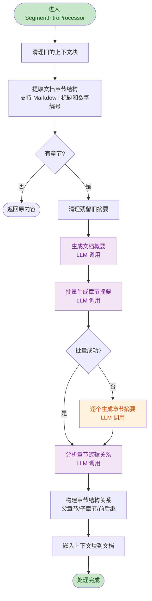
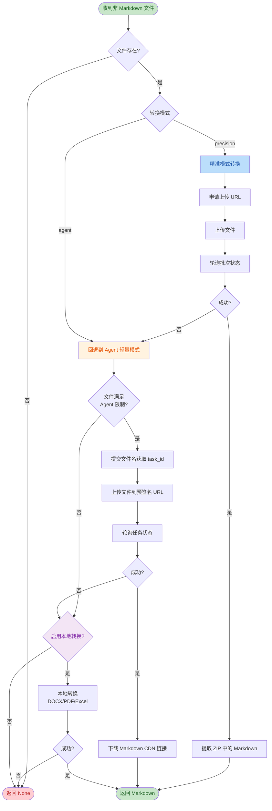
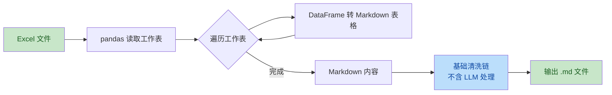

# Markdown 文档清理工具

**版本：V0.4.0** | **开发者：Wu Hao** | **邮箱：i_net_sky@hotmail.com** | **最后更新：2026-06-24**

一个基于 Python 和 LLM 的命令行工具，用于清理 Markdown 格式的技术文档。可去除噪声、统一编码、修复错误、去重，并通过大语言模型自动生成文档概要、段落摘要和逻辑关联。支持通过 MinerU API 将 PDF、Word、PPT 等文件自动转换为 Markdown 格式后处理，支持通过 pandas 直接将 Excel 文件转换为 Markdown 表格。

## 功能特性

- **多格式支持**：通过 MinerU API 自动将 PDF、Word、PPT、图片等文件转换为 Markdown
- **Excel 直接转换**：使用 pandas 将 Excel 文件（.xlsx/.xls）直接转换为 Markdown 表格，无需 API 调用
- **分批处理**：支持按配置的批次大小分批处理文件，避免资源占用过高
- **临时目录管理**：转换后的中间文件存放在临时目录，处理完成后自动清理，保持 input 目录整洁
- **去噪**：移除页眉、页脚、页码、连续空行、多余空格和制表符
- **编码统一**：UTF-8 编码、标点符号统一、清除不可见字符、换行符标准化
- **表格清理**：将 HTML 表格转换为标准 Markdown 表格，规范化格式
- **去重简化**：删除重复段落、统一段落格式
- **错误修复**：检测并修复不合理的换行、恢复正确的段落边界
- **格式规范**：按标准 Markdown 格式规范输出
- **文档概要**：通过 LLM 提炼文档核心主题，生成精炼的1-2句概要
- **段落上下文**：在一级和二级大段落标题下方添加文档概要和本段摘要
- **逻辑关联**：自动分析段落间的逻辑依赖关系（前置步骤、后续步骤等）
- **目录识别**：自动识别目录部分，不添加上下文信息
- **子段落过滤**：子级段落（如 `2.1 注册到红帽官网`）不添加上下文信息

---

## 环境要求

- Python 3.12+
- 可访问的 OpenAI 兼容 API（用于 LLM 摘要生成）
- MinerU API 密钥（用于非 Markdown 文件转换，可选）

## 安装

```bash
pip install -r requirements.txt
```

依赖列表：
- `pyyaml>=6.0` - 配置文件解析
- `openai>=1.0` - LLM API 调用
- `pandas>=1.5` - Excel 文件读取与转换
- `openpyxl>=3.0` - Excel 文件底层解析引擎
- `requests>=2.28` - MinerU API HTTP 请求
- `tqdm>=4.65` - 进度条显示
- `pdfplumber>=0.11` - PDF 页数检测与本地转换
- `python-docx>=0.8.11` - DOCX 文件本地转换

## 配置

项目根目录下的 `config.yaml` 为配置文件，包含 LLM、处理配置和 MinerU 三部分配置：

### LLM 配置

```yaml
llm:
  api_key: "your_api_key"
  base_url: "http://your-llm-api-server/v1"
  model: "qwen3-vl-2b-instruct"
  timeout: 120
  temperature: 0.3
  max_tokens: 8192
```

| 配置项 | 说明 |
|--------|------|
| `api_key` | LLM API 密钥 |
| `base_url` | OpenAI 兼容 API 地址 |
| `model` | 模型名称 |
| `timeout` | 请求超时时间（秒） |
| `temperature` | 生成温度 |
| `max_tokens` | 最大生成 token 数 |

### 处理配置

```yaml
processing:
  batch_size: 2
```

| 配置项 | 说明 |
|--------|------|
| `batch_size` | 每批次处理的文件数量，默认为 2。将文件分批处理，避免同时处理过多文件导致资源占用过高 |

### MinerU 配置

```yaml
mineru:
  api_key: "your_mineru_api_key"
  mode: "precision"
  model_version: "vlm"
  base_url: "https://mineru.net"
  batch_upload_url: "https://mineru.net/api/v4/file-urls/batch"
  poll_interval: 15
  poll_timeout: 300
  fallback_local_convert: true
```

| 配置项 | 说明 |
|--------|------|
| `api_key` | MinerU API 密钥（精准解析模式必填） |
| `mode` | 解析模式：`precision`（精准解析）或 `agent`（轻量解析） |
| `model_version` | 模型版本：`pipeline`、`vlm`（推荐）或 `MinerU-HTML` |
| `base_url` | MinerU API 基础地址 |
| `batch_upload_url` | 批量上传 API 路径（仅精准解析模式使用） |
| `poll_interval` | 轮询间隔（秒） |
| `poll_timeout` | 轮询超时（秒） |
| `fallback_local_convert` | MinerU 转换失败后是否尝试本地转换（仅对 DOCX/PDF/Excel 有效） |

**两种解析模式对比：**

| 维度 | 精准解析 | Agent 轻量解析 |
|------|----------|----------------|
| Token 要求 | 需要 API Key | 不需要（IP 限流） |
| 文件大小限制 | ≤ 200MB | ≤ 10MB |
| 页数限制 | ≤ 600 页 | ≤ 20 页 |
| 批量支持 | 支持（≤ 200 文件） | 不支持（单文件） |
| 输出格式 | ZIP（Markdown + JSON） | Markdown |
| 表格/公式识别 | 支持（可配置） | 支持（可配置） |

## 使用方法

```bash
python main.py <输入目录> <输出目录> [--config 配置文件] [--mode precision|agent]
```

### 参数说明

| 参数 | 说明 |
|------|------|
| `input_dir` | 输入目录路径（必需），包含待处理的文件 |
| `output_dir` | 输出目录路径（必需），存放清理后的文件（不存在则自动创建） |
| `--config` | 指定配置文件路径（可选，默认：项目根目录下的 `config.yaml`） |
| `--mode` | MinerU 转换模式（可选）：`precision`（精准）/`agent`（轻量），默认使用配置文件中的设置 |

### 示例

```bash
# 使用 input 和 output 目录
python main.py input output

# 指定自定义目录
python main.py ./raw_docs ./cleaned_docs

# 指定配置文件和 MinerU 模式
python main.py input output --config /path/to/config.yaml --mode precision
```

## 支持的文件类型

### 直接处理（Markdown 格式）
- `.md`、`.markdown`

### 通过 pandas 直接转换（不经过大模型）
- **Excel**：`.xlsx`、`.xls` — 直接转换为 Markdown 表格，仅做数据清洗，不生成上下文摘要

### 通过 MinerU API 转换后处理
- **文档**：`.pdf`、`.doc`、`.docx`、`.ppt`、`.pptx`
- **图片**：`.png`、`.jpg`、`.jpeg`、`.bmp`、`.tiff`、`.tif`
- **网页**：`.html`、`.htm`
- **其他**：`.xps`、`.epub`

---

## 系统架构

### 整体架构

项目采用分层架构设计，分为入口层、协调层、处理器层和工具层四个层次，各层职责清晰、单向依赖。



### 模块职责说明

#### 入口层（main.py）

命令行入口，负责：
- 解析命令行参数（输入目录、输出目录、配置文件、MinerU 模式）
- 校验输入目录存在性和 MinerU 模式合法性
- 初始化日志系统（在清洗器实例化之前完成）
- 按文件类型分发处理流程（Markdown / Excel / 其他格式）
- 协调 MinerU 客户端、Excel 转换器和清洗器的调用

#### 协调层（cleaner.py）

`MarkdownCleaner` 类作为核心协调器，维护两条处理器链：
- **完整清洗链**（`clean` 方法）：包含全部 7 个处理器，适用于需要 LLM 分析的文档
- **基础清洗链**（`clean_basic` 方法）：仅包含前 6 个数据清洗处理器，不含 LLM 分析，适用于 Excel 等数据型文件

#### 处理器层（processors/）

所有处理器实现统一接口 `process(content: str) -> str`，按顺序对 Markdown 内容进行处理。每个处理器专注于单一职责，可独立测试和替换。

#### 工具层（utils/）

提供配置管理、文件 I/O、日志记录、LLM 调用、MinerU API 调用、文件格式转换等基础能力，被上层模块复用。

---

## 项目结构

```
data_cleaning/
├── main.py                              # CLI 入口，参数解析与流程调度
├── config.yaml                          # 配置文件（LLM + 处理 + MinerU）
├── requirements.txt                     # 依赖列表
├── README.md                            # 本文件
├── input/                               # 输入目录（放置待处理文件）
├── output/                              # 输出目录（存放处理结果）
├── log/                                 # 日志目录（运行时自动创建）
├── doc_cleaner/                         # 核心包
│   ├── __init__.py                      # 包初始化与版本信息
│   ├── cleaner.py                       # 主清理器协调器（处理器链管理）
│   ├── processors/                      # 处理器模块
│   │   ├── __init__.py                  # 处理器导出
│   │   ├── encoding.py                  # 编码统一处理器
│   │   ├── denoise.py                   # 去噪处理器
│   │   ├── tables.py                    # 表格处理器
│   │   ├── errors.py                    # 错误修复处理器
│   │   ├── dedup.py                     # 去重处理器
│   │   ├── format_standardization.py    # 格式标准化处理器
│   │   └── segment_intro.py             # LLM 段落摘要与逻辑关联处理器
│   └── utils/                           # 工具模块
│       ├── __init__.py                  # 工具模块导出
│       ├── config.py                    # 配置加载与管理
│       ├── file_io.py                   # 文件读写与目录扫描
│       ├── logger.py                    # 日志记录器
│       ├── llm_client.py                # LLM API 客户端
│       ├── mineru_client.py             # MinerU API 客户端
│       ├── excel_converter.py           # Excel 转 Markdown 转换器
│       ├── docx_converter.py            # DOCX 转 Markdown 转换器
│       └── local_converter.py           # 本地多格式转换（MinerU 回退方案）
└── tests/                               # 测试文件目录
```

---

## 处理流程

### 主流程

`main.py` 按文件类型分发到三条处理路径，每条路径最终都经过清洗器处理器链处理。



### 清洗器处理器链

清洗器按固定顺序执行处理器链，每个处理器接收上一个处理器的输出作为输入。完整清洗链包含 7 个处理器，基础清洗链包含前 6 个（不含 LLM 处理）。


### 各处理器详细说明

#### 1. EncodingProcessor（编码统一）

| 处理项 | 说明 |
|--------|------|
| 换行符统一 | 将 `\r\n` 和 `\r` 统一为 `\n` |
| 不可见字符移除 | 移除零宽空格、零宽连接符、BOM 等 |
| 特殊符号标准化 | OCR 误识别字符标准化（如 `≡` → `=`、全角空格 → 半角空格） |
| 标点符号统一 | 中文语境下半角→全角，英文语境下全角→半角（保护代码块） |
| UTF-8 校验 | 确保输出为有效 UTF-8 编码 |

#### 2. DenoiseProcessor（去噪处理）

| 处理项 | 说明 |
|--------|------|
| 换行符统一 | 统一为 `\n` |
| 制表符处理 | 替换为 4 个空格（保护代码块） |
| 多余空格 | 3 个以上连续空格缩减为 1 个 |
| 行尾空白 | 移除每行行尾空白字符 |
| 页码移除 | 移除 `Page N`、`- N -`、`[N]`、`N/M` 等页码格式 |
| 空行压缩 | 3 行以上连续空行缩减为 2 行 |

#### 3. TableProcessor（表格处理）

| 处理项 | 说明 |
|--------|------|
| HTML 表格转换 | 将 `<table>` 元素转换为标准 Markdown 表格 |
| 表格行合并 | 合并因换行断裂的表格行 |
| 分隔行标准化 | 确保表头分隔行使用 `---` |
| 表格识别约束 | 表格行必须以 `\|` 开头或结尾，避免误判普通文本 |

#### 4. ErrorProcessor（错误修复）

| 处理项 | 说明 |
|--------|------|
| 代码注释标题修复 | 将 `# systemctl start httpd` 等命令注释转义为纯文本（含中文的标题不转义） |
| 断裂标题修复 | 合并跨行断裂的标题（如 `# 三、` + `防火` + `# 墙`） |
| 段落断裂修复 | 合并段落内的断裂行和多余换行（PDF 转换常见问题） |
| 行首空格修复 | 保留列表项缩进（最多 3 空格），移除普通文本行首多余空格 |
| 代码块保护 | 确保代码块前后有空行 |

#### 5. DedupProcessor（去重处理）

| 处理项 | 说明 |
|--------|------|
| 代码块保护 | 提取代码块为占位符，避免代码块内重复内容被误删 |
| 段落去重 | 使用 MD5 哈希对段落精确去重，保留首次出现 |
| 段落重组 | 用双换行重新组合唯一段落 |

#### 6. FormatStandardizationProcessor（格式标准化）

| 处理项 | 说明 |
|--------|------|
| 标题格式 | `#` 后确保一个空格，剥离尾部闭合 `#` |
| 列表格式 | 统一无序列表标记，标准化有序列表格式 |
| 代码块空行 | 确保代码块前后有空行 |
| 水平线统一 | 统一为 `---`，确保前后有空行（保护上下文块边界） |
| 行尾空格 | 移除所有行尾空白 |
| 标题空行 | 确保标题前后有空行 |
| 表格格式 | 补充表格格式标准化 |

#### 7. SegmentIntroProcessor（LLM 摘要与逻辑关联）

此处理器仅在完整清洗链中执行，使用 LLM 生成文档级和章节级的摘要信息。



**大段落判定规则**：取文档中实际出现的最高层级标题和次高层级标题作为大段落。例如文档只有 `###` 标题时，`###` 即为大段落；文档有 `##` 和 `###` 标题时，`##` 为大段落。

### MinerU 文件转换流程

非 Markdown 文件通过 MinerU API 转换，采用三级回退策略确保转换成功率。



**Agent 模式限制**：
- 文件大小 ≤ 10MB
- PDF 页数 ≤ 20 页
- 一次只能解析一个文件（强制 batch_size=1）

### Excel 文件处理流程

Excel 文件使用 pandas 直接转换为 Markdown 表格，不经过 MinerU API 和 LLM 处理。



---

## 输出示例

一级和二级大段落标题下方会添加上下文信息：

```markdown
# 一、环境简介

---
文档概要：本手册指导如何搭建基于离线CDN的RHEL yum源，实现系统软件包的离线安装与更新。
本段概要：搭建卫星服务器与红帽官网连接，用于仓库源下载，并在测试环境配置yum源服务器。
逻辑关联：所属章节：无；包含小节：二、系统环境部署需求；下一节：二、系统环境部署需求
---

段落正文内容...
```

子段落（如 `2.1 注册到红帽官网`）和目录部分不添加上下文信息。

Excel 文件仅做数据清洗和格式规范，不添加上下文信息。

---

## 日志系统

程序运行时自动在项目根目录下创建 `log/` 目录，日志文件按时间戳命名（格式：`clean_YYYYMMDD_HHMMSS.log`）。

- **控制台输出**：INFO 级别及以上，显示执行进度
- **日志文件**：DEBUG 级别及以上，记录详细处理信息

日志内容包括：文件处理进度、批次信息、各处理器执行耗时、LLM 调用状态、MinerU 转换状态、错误和警告等。

---

## 版本历史

| 版本 | 日期 | 说明 |
|------|------|------|
| V0.4.0 | 2026-06-24 | 修复：config.py MinerU 默认值补充、excel_converter 导入修复、MinerU 批量上传支持、LLM 摘要截断 |
| V0.3.0 | 2026-06-18 | 代码审查修复：LLM 超时配置、标题闭合#处理、表格行判断约束、异常日志记录、MinerU 模式校验、日志初始化顺序优化、删除死代码 |
| V0.2.2 | 2026-04-09 | 新增 Excel 文件直接转换（pandas）、分批处理、临时目录管理；Excel 文件不经过大模型处理 |
| V0.2.1 | 2026-04-09 | 新增 MinerU API 集成，支持 PDF/Word/PPT/图片等多格式文件自动转换 |
| V0.2.0 | 2026-04-08 | 新增 LLM 段落上下文与逻辑关联功能，优化子段落过滤和摘要精炼度 |
| V0.1.0 | 2026-04-07 | 初始版本，支持 Markdown 文档去噪、编码统一、表格清理、去重和格式规范 |

## License

MIT

## 联系方式

- 开发者：Wu Hao
- 邮箱：i_net_sky@hotmail.com
