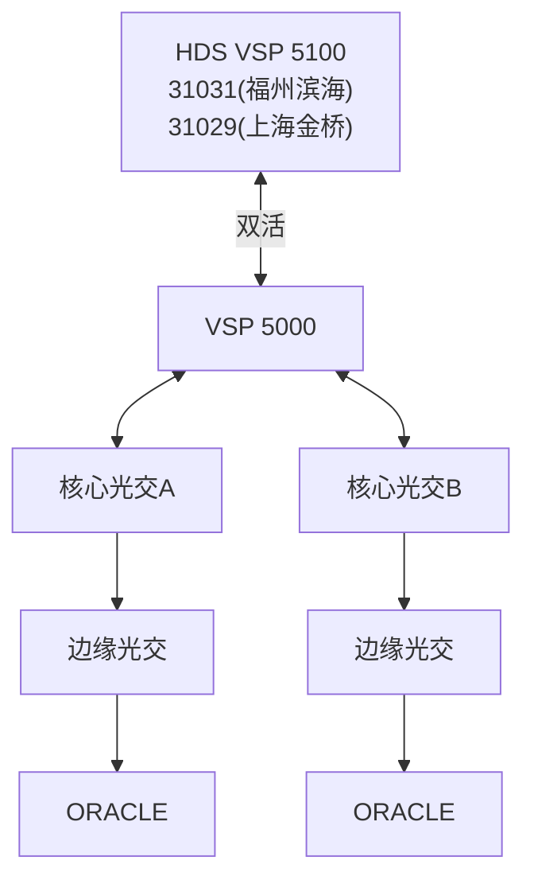
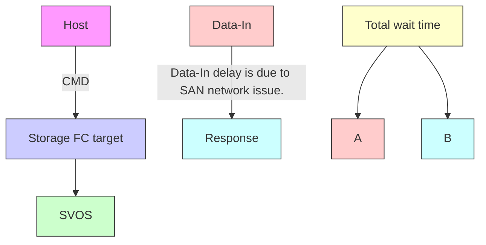
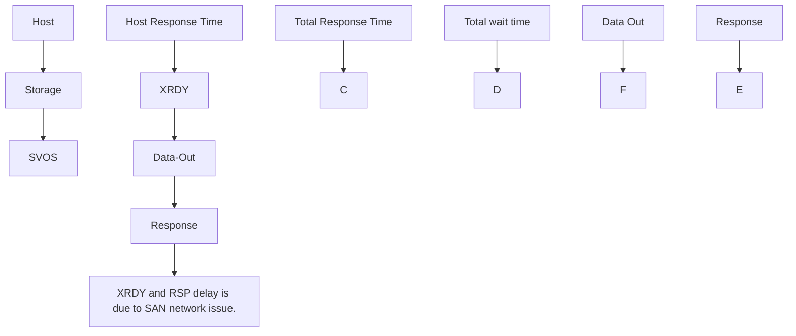

Date: 2025-03-21
Revision: 1.0

# 兴业证券数据库应用 redo 卷时延增高问题分析报告

---
文档概要：报告分析2025年3月起兴业证券两套数据库redo日志卷时延增高问题，涉及4台日立GAD双活存储。通过存储dump日志和性能数据分析，定位根因并提出优化建议。
本段概要：报告标题，分析兴业证券数据库redo卷时延增高问题，涉及两套应用和日立GAD存储。
逻辑关联：包含小节：目录
下一节：问题概述.
---

| Product Type/Serial Number | Microcode Revision | Case Number |
| VSP F5100/31031&amp;31029 | 90-09-22-00/00 | 05047439 |

## 目录

---
文档概要：报告分析2025年3月起兴业证券两套数据库redo日志卷时延增高问题，涉及4台日立GAD双活存储。通过存储dump日志和性能数据分析，定位根因并提出优化建议。
本段概要：列出报告章节、页码，包括问题概述、分析、结论等结构。
逻辑关联：所属章节：兴业证券数据库应用 redo 卷时延增高问题分析报告
包含小节：应用对应的 MDKC 存储日志分析 6
上一节：兴业证券数据库应用 redo 卷时延增高问题分析报告
下一节：问题概述.
---

1 问题概述.

---
文档概要：报告分析2025年3月起兴业证券两套数据库redo日志卷时延增高问题，涉及4台日立GAD双活存储。通过存储dump日志和性能数据分析，定位根因并提出优化建议。
本段概要：描述2025/3/10起两套数据库redo日志卷出现时延增高，提供警告日志示例。
逻辑关联：包含小节：存储 Dump 日志分析 . 6
上一节：兴业证券数据库应用 redo 卷时延增高问题分析报告
下一节：问题分析.
---
2 问题分析.

---
文档概要：报告分析2025年3月起兴业证券两套数据库redo日志卷时延增高问题，涉及4台日立GAD双活存储。通过存储dump日志和性能数据分析，定位根因并提出优化建议。
本段概要：对时延增高问题进行深入分析，包括存储日志和性能数据。
逻辑关联：包含小节：存储 Dump 日志分析 . 6
上一节：问题概述.
下一节：结论和建议... .21
---

2.1 存储 Dump 日志分析 . 6

---
文档概要：报告分析2025年3月起兴业证券两套数据库redo日志卷时延增高问题，涉及4台日立GAD双活存储。通过存储dump日志和性能数据分析，定位根因并提出优化建议。
本段概要：分析存储dump日志，涵盖MDKC和RDKC的读写操作。
逻辑关联：所属章节：问题分析.
包含小节：应用对应的 MDKC 存储日志分析 6
上一节：问题分析.
下一节：性能数据分析 . .16
---
2.1.1 应用对应的 MDKC 存储日志分析 6
2.1.2 应用对应的 RDKC 存储日志分析. 9
2.2 性能数据分析 . .16

---
文档概要：报告分析2025年3月起兴业证券两套数据库redo日志卷时延增高问题，涉及4台日立GAD双活存储。通过存储dump日志和性能数据分析，定位根因并提出优化建议。
本段概要：分析存储资源利用率、redo日志卷性能及读写响应时间。
逻辑关联：所属章节：问题分析.
包含小节：存储资源利用率分析 .16
上一节：存储 Dump 日志分析 . 6
下一节：结论和建议... .21
---
2.2.1 存储资源利用率分析 .16
2.2.2 Redo 日志卷性能分析.
2.2.3 关于存储读写响应时间 .20
3 结论和建议... .21

---
文档概要：报告分析2025年3月起兴业证券两套数据库redo日志卷时延增高问题，涉及4台日立GAD双活存储。通过存储dump日志和性能数据分析，定位根因并提出优化建议。
本段概要：给出问题结论和解决建议，如优化存储配置或调整应用。
逻辑关联：包含小节：1 问题概述
上一节：问题分析.
---

## 1 问题概述

---
文档概要：报告分析2025年3月起兴业证券两套数据库redo日志卷时延增高问题，涉及4台日立GAD双活存储。通过存储dump日志和性能数据分析，定位根因并提出优化建议。
本段概要：两套数据库应用redo日志卷从2025/3/10起陆续出现写时延增高事件。
逻辑关联：所属章节：结论和建议... .21
上一节：结论和建议... .21
下一节：2 问题分析
---

从 2025/3/10 开始，有两套数据库应用（UF20-DB01BHP 和 ZYO32\_DB01JQ）所使用的redo 日志卷陆续出现时延增高的现象，统计到的事件如下（以 ZYO32\_DB01JQ 为例）：

```txt
*** 2025-03-10 10:08:00.374
Warning: log write elapsed time 30839ms, size 7KB
*** 2025-03-10 10:08:24.394
--
*** 2025-03-10 10:19:05.334
Warning: log write elapsed time 30125ms, size 1KB
*** 2025-03-10 10:19:29.342
--
*** 2025-03-10 13:02:20.342
Warning: log write elapsed time 30420ms, size 1KB
*** 2025-03-10 13:03:35.341
--
*** 2025-03-10 13:09:10.534
Warning: log write elapsed time 30370ms, size 0KB
*** 2025-03-10 13:09:16.543
--
*** 2025-03-10 13:50:49.334
Warning: log write elapsed time 30155ms, size 2KB
*** 2025-03-10 13:51:01.341
--
*** 2025-03-10 13:57:14.359
Warning: log write elapsed time 30504ms, size 1KB
*** 2025-03-10 13:57:47.360
--
*** 2025-03-10 14:03:02.751
Warning: log write elapsed time 11065ms, size 1KB
*** 2025-03-10 14:03:11.755
--
*** 2025-03-10 14:28:47.574
Warning: log write elapsed time 30814ms, size 1KB
*** 2025-03-10 14:29:50.581
--
*** 2025-03-10 14:42:13.240
```

Warning: log write elapsed time 11178ms, size 2KB
NSS2 is not running anymore.

\*\*\* 2025-03-10 14:55:53.264
Warning: log write elapsed time 11115ms, size 4KB
\*\*\* 2025-03-10 14:55:56.284
\*\*\* 2025-03-11 09:41:35.222
Warning: log write elapsed time 11021ms, size 2KB
\*\*\* 2025-03-11 09:42:32.234
\*\*\* 2025-03-11 09:50:22.335
Warning: log write elapsed time 30971ms, size 6KB
\*\*\* 2025-03-11 09:50:28.340
\*\*\* 2025-03-11 10:06:32.714
Warning: log write elapsed time 11037ms, size 1KB
\*\*\* 2025-03-11 10:06:59.721
\*\*\* 2025-03-11 10:32:39.325
Warning: log write elapsed time 11227ms, size 8KB
\*\*\* 2025-03-11 10:33:21.331
\*\*\* 2025-03-11 13:14:10.358
Warning: log write elapsed time 30656ms, size 1KB
\*\*\* 2025-03-11 13:14:19.361
\*\*\* 2025-03-11 13:55:35.638
Warning: log write elapsed time 30959ms, size 1KB
\*\*\* 2025-03-11 13:56:08.641
\*\*\* 2025-03-11 19:55:31.390
Warning: log write elapsed time 11359ms, size 1KB
\*\*\* 2025-03-11 19:56:10.392
\*\*\* 2025-03-12 09:40:35.638
Warning: log write elapsed time 30239ms, size 1KB
\*\*\* 2025-03-12 09:44:38.642
\*\*\* 2025-03-12 10:34:49.422
Warning: log write elapsed time 11062ms, size 5KB

```txt
*** 2025-03-12 10:40:04.431
--
*** 2025-03-12 11:13:31.351
Warning: log write elapsed time 30087ms, size 3KB
*** 2025-03-12 11:13:49.368
```

这两套应用分别连接到位于福州滨海数据中心和上海金桥数据中心的日立 GAD 双活存储，涉及的这4台存储配置情况如下表。

|  | bh71 | bh72 | jq71 | jq72 |
| SN | 31031 | 31251 | 31029 | 31028 |
| 安装位置 | 福州滨海 | 福州滨海 | 上海金桥 | 上海金桥 |
| 磁盘 | 50*7.6TB NVMe 6D+2P | 50*7.6TB NVMe 6D+2P | 50*7.6TB NVMe 6D+2P | 50*7.6TB NVMe 6D+2P |
| 可用容量 (TB) | 247.58 | 247.58 | 247.58 | 247.58 |
| Cache | 1TB | 1TB | 1TB | 1TB |
| CHB | 4 对 | 4 对 | 4 对 | 4 对 |
| 前端口 | 24*32Gbps | 24*32Gbps | 24*32Gbps | 24*32Gbps |
| Firmware | 90-09-22-00/00 | 90-09-22-00/00 | 90-09-22-00/00 | 90-09-22-00/00 |
| SVOS | 9.9 | 9.9 | 9.9 | 9.9 |
| 备注 | GAD Primary | GAD Secondary | GAD Primary | GAD Secondary |

应用和存储的连接拓扑示意图如下：




应用使用的日志卷为：

UF20-DB01BHP:03:22，使用的存储端口为：3C/4D
ZYO32\_DB01JQ:40:6B，使用的存储端口为：3A/4B

## 2 问题分析

---
文档概要：报告分析2025年3月起兴业证券两套数据库redo日志卷时延增高问题，涉及4台日立GAD双活存储。通过存储dump日志和性能数据分析，定位根因并提出优化建议。
本段概要：分析时延增高的根本原因，涉及存储日志和性能指标。
逻辑关联：所属章节：结论和建议... .21
上一节：1 问题概述
下一节：2.1 存储 Dump 日志分析
---

## 2.1 存储 Dump 日志分析

---
文档概要：报告分析2025年3月起兴业证券两套数据库redo日志卷时延增高问题，涉及4台日立GAD双活存储。通过存储dump日志和性能数据分析，定位根因并提出优化建议。
本段概要：通过存储dump日志定位问题，包括MDKC和RDKC模块。
逻辑关联：所属章节：结论和建议... .21
上一节：2 问题分析
下一节：2.1.1 应用对应的 MDKC存储日志分析
---

## 2.1.1 应用对应的 MDKC存储日志分析

---
文档概要：报告分析2025年3月起兴业证券两套数据库redo日志卷时延增高问题，涉及4台日立GAD双活存储。通过存储dump日志和性能数据分析，定位根因并提出优化建议。
本段概要：分析应用对应MDKC存储的写操作日志（WRITE）。
逻辑关联：所属章节：结论和建议... .21
上一节：2.1 存储 Dump 日志分析
下一节：WRITE
---

从 MDKC 存储（31029）底层日志可以看到 ZYO32\_DB01JQP 应用对应的 4B 端口在部分时段出现了I/O传输延迟的现象，出现延迟的卷正是这套应用所使用的Redo日志道卷，大部分为写 I/O(SCSI CMD=2A:write）方向，根据出现的 SSB 特征码 D034/D031,I/O 传输延迟的原 因为“等待数 据传 输”，问 题指 向存 储外 部链 路端，其构 成组 件包 括
1)FC-HBA(WWN=100000620B3AC203)、2)FC-HBA 到交换机的光纤线、3)FC-HBA 在交换机上的SFP 模块、4)存储4B 端口上的SFP 模块、5)存储 4B 到交换机的光纤线、6) 存储4B 端口在交换机上的SFP 模块：

```csv
2025/03/11 10:32:42 B6C0# 3C 4B : xlmain It FCP Frame-receives from non-LOGIN HOST.
2025/03/11 10:32:42 B358# 3F 4B : qlsnhllicb LL IOCB was issued
2025/03/11 10:32:42 B3FF 3F 4B : snptovssb Information enhancement for transfer TOV
2025/03/11 10:32:42 B6AD# 3F 4B : tpcc_xlfhostssb Information enhancement for transfer TOV/count error (Host information: Port ID, WWN)
2025/03/11 10:32:42 B6A9# 3F 4B : snptov Complementing information log for transfer TOV (LM)
2025/03/11 10:32:42 D034# 3F 4B 04:6B : fcmxrvtov Sync command Read/Write JOB TOV
2025/03/11 10:32:42 D031# 3F 4B 04:6B : fcmxssbtv Additional information of SSB=d030/d034 (OPEN command, SCSI reset/TOV)
2025/03/11 10:32:42 DDA1# 3F 4B : cktov_lm Data transfer (Tachyon) completion TOV
2025/03/11 10:32:42 DDA1# 3F 4B 04:6B : cktov_lm Data transfer (Tachyon) completion TOV
2025/03/11 10:32:42 FFFB# 4B LOGO : LINK ELS EVENT Type = LOGO
2025/03/11 10:32:33 D555# 3F 4B 04:6B : fcmxd555s Information enhancement log was output because job running time of more than l sec was detected
2025/03/11 09:11:28 10F5 07 : timdiv Async processing was performed forcibly
2025/03/11 08:54:30 10F5 0E : timdiv Async processing was performed forcibly
2025/03/11 07:11:36 10F5 10 : timdiv Async processing was performed forcibly
2025/03/11 07:00:43 10F5 00 : timdiv Async processing was performed forcibly
```

| Refcode = D034 : fcmxrwtov Sync command Read/Write JOB TOV |
| DATE TIME | PORT | LDEV# | CMD | KEY/ASC | HG-NAME | WAIT REASON | HOST WWN / IQN | FCID |
| 2025/03/11 19:55:32 | 4B | 00:04:6B | 2A | B/C001 | ZYO32_DB01JQP | Wait for Data Transfer | 100000620B3AC203 | 490000 |
| 2025/03/11 10:32:42 | 4B | 00:04:6B | 2A | B/C001 | ZYO32_DB01JQP | Wait for Data Transfer | 100000620B3AC203 | 490000 |
| 2025/02/13 23:11:12 | 4B | 00:04:6C | 8A | B/C001 | ZYO32_DB01JQP | Wait for Data Transfer | 100000620B3AC203 | 490000 |
| 2025/02/13 23:01:26 | 4B | 00:04:6C | 8A | B/C001 | ZYO32_DB01JQP | Wait for Data Transfer | 100000620B3AC203 | 490000 |
| 2025/02/13 09:59:30 | 4B | 00:04:6B | 2A | B/C001 | ZYO32_DB01JQP | Wait for Data Transfer | 100000620B3AC203 | 490000 |
| 2025/02/13 09:53:15 | 4B | 00:04:6B | 2A | B/C001 | ZYO32_DB01JQP | Wait for Data Transfer | 100000620B3AC203 | 490000 |
| 2025/02/13 09:49:28 | 4B | 00:04:6B | 2A | B/C001 | ZYO32_DB01JQP | Wait for Data Transfer | 100000620B3AC203 | 490000 |
| 2025/02/12 10:10:25 | 4B | 00:04:6B | 2A | B/C001 | ZYO32_DB01JQP | Wait for Data Transfer | 100000620B3AC203 | 490000 |

根据存储端4B 端口的错误计数器，没有发现用于判断4B 端口SFP模块和4B 端口到交换机的连线的计数器有异常增长情况，因此可以排除 4B 端口SFP 模块和4B 端口到交换机的连线问题：

CRC: 如果该计数器不为0，基本上为存储端口SFP 模块问题；
⚫ EOFa: 如果该计数器不为0，基本上为存储端口到交换机之间的连线问题

```txt
PORT LABEL = 4B
16G FC Port Statistics
| Hex_Count | Decimal_Count | Port_Stats_Description
|----|----|----
| 00000000 |    0 |Link Failure
| 00000000 |    0 |Loss of Sync
| 00000000 |    0 |Loss of Signal

```

```csv
| 00000000 | 0 | Primitive Sequence Protocol Error
| 00000000 | 0 | Invalid Transmission Word
| 00000000 | 0 | Invalid CRC
| 00000000 | 0 | LIP Occurred
| 00000000 | 0 | Link UP
| 00000000 | 0 | Link Down_LoopInitializeTimeout
| 00000000 | 0 | Loss of Signal
| 00000000 | 0 | Loss of Received Clock
| 00000000 | 0 | NOS_OLS >200ms continuously Received
| 00000000 | 0 | Link Reset Received
| 00000000 | 0 | LIP F7 Received
| 00000000 | 0 | LIP F8 Received
| 00000000 | 0 | Connected P2P Mode
| 00000000 | 0 | Port Configuration Changed
| 00000000 | 0 | L-Bit Detected
| 00000000 | 0 | Connection Fabric P2P
| 00000000 | 0 | Connection Fabric Loop
| 00000000 | 0 | Connection Private Loop
| 00000000 | 0 | Connection P2P
| 00000000 | 0 | NOS or OLS for >200 mSec (or user defined value) in the init f/w control block
| 00000000 | 0 | P2P Link Event Timeout
| 00000000 | 0 | Loop Initialize Protocol Error
| 00000000 | 0 | LR Initiated by 16G_CHA Protocol CHIP
| 00000000 | 0 | LRR Received by 16G_CHA Protocol CHIP
| 00000000 | 0 | LIP generated by ISP due to tout when attempt to transmit non-data frame
| 00000000 | 0 | Response Queue Full
| 00000000 | 0 | ATIO Queue Full
| 00000000 | 0 | Drop AE due to lack of resources
| 00000000 | 0 | ELS Protocol Error Detected by Firmware
| 1661674358 | Transmit Frame Count from 16G_CHA Protocol CHIP
| DDB5C113 | 351572371 | Discarded Frame Count From 16G_CHA Protocol CHIP
| 631674358 | Received Frame Count From 16G_CHA Protocol CHIP
| 1661674358 | Not Used
| 1661674358 | Not Used
| 1661674358 | Not Used
| Not Used

```

```typescript
| 00000000 | 0 |Class2 Sequence Timeout
| 00000000 | 0 |P_RJT Frame Transmit
| 00000000 | 0 |Failure to allocate exchange resource when receiving a frame for a new exchange
| 00002630 | 9776 |ABTS Received
| 00000001 | 1 |Received sequences with a missing frame
| 00000000 | 0 |Correctable Error
| 0109FD7E | 17431934 |Mailbox Commands Issued
| 00000000 | 0 |Failure to allocate NportHandle when receiving an ELS frame
| 00000000 | 0 |Received EOFa

```

写I/O过程及错误特征码（示意）：

## WRITE

---
文档概要：报告分析2025年3月起兴业证券两套数据库redo日志卷时延增高问题，涉及4台日立GAD双活存储。通过存储dump日志和性能数据分析，定位根因并提出优化建议。
本段概要：MDKC日志中写操作部分，分析redo写入时延增高的具体记录。
逻辑关联：所属章节：结论和建议... .21
上一节：2.1.1 应用对应的 MDKC存储日志分析
下一节：2.1.2 应用对应的 RDKC存储日志分析
---

```txt
HBA/INI : WRITE CMD (4K) =====X0 =====--> TGT/RCU-TGT
    <Round-Trip Gap-1>
    <========X1======== Transfer Ready FRME
DATA-FRAME-0 =====X2========>
DATA-FRAME-1 =====X3========>
    <Round-Trip Gap-2>
    <========X4========STATUS FRAME
```

Ona WRITE CMD Sequence, such as shown above, depending on which FRAME gets lost of damaged,will cause different SSB to be logged and cause a different level of Response Impact to the Host.
Thus understanding the SSB that are logged and how they correspond with the above errors can help focusing on where to look for errors in a Fabric and/or Internally in a DKC.
· KEY SSB for WRITE IO related LINK issues:B65C,DDA1, B6FE,D034
There is some Notes below on when some of above LOG relative to the timing of the “Xo to X4" errors above.
The “Round-Trip Gaps 1&2" shown above depend entirely on the DISTANCE between the HBA/INl and Target PORTS. Rule of thumb is “1ms" per “100KM" per Round-Trip. This holds wellpretty wellif the LINKS are purely DARK-FIBRE LINKS. If there is FCIP in a WAN things can change dramatically to the worse.

## 2.1.2 应用对应的 RDKC存储日志分析

---
文档概要：报告分析2025年3月起兴业证券两套数据库redo日志卷时延增高问题，涉及4台日立GAD双活存储。通过存储dump日志和性能数据分析，定位根因并提出优化建议。
本段概要：分析应用对应RDKC存储的读操作日志（READ）。
逻辑关联：所属章节：结论和建议... .21
上一节：WRITE
下一节：READ
---

从 RDKC 存储（31028）底层日志也可以看到 ZYO32\_DB01JQP 应用对应的 4B 端口在部 分时段出现了I/O传输延迟的现象，读和写方向都有，

| 2025/03/11 10:24:49 | 139€ | 44 |  | : The number of segments per CPK as an additional information of SSB:13F3 |
| 2025/03/11 10:24:49 | 13F3# | 44 |  | : s_gfsgm At Hit/Miss, segment reservation timeout occurred (Waiting for free segment) (Inhibited for 1 hour/MPB) |
| 2025/03/11 10:24:29 | 10F5 | 4B |  | : timdiv Async processing was performed forcibly |
| 2025/03/11 10:06:44 | FFFB# |  | 4B | PLOGI: LINK ELS EVENT Type = PLOGI |
| 2025/03/11 10:06:43 | B6C0# | 3E | 4B | : xlmain It FCP Frame-receives from non-LOGIN HOST. |
| 2025/03/11 10:06:43 | B358# | 02 | 4B | : qlsnhlliocb LL IOCB was issued |
| 2025/03/11 10:06:43 | B3FF | 02 | 4B | : snptovssb Information enhancement for transfer TOV |
| 2025/03/11 10:06:43 | B6AD# | 02 | 4B | : tpcc_xlfhostssb Information enhancement for transfer TOV/count error (Host information: Port ID, WWN) |
| 2025/03/11 10:06:43 | B6A9# | 02 | 4B | : snptov Complementing information log for transfer TOV (LM) |
| 2025/03/11 10:06:43 | D034# | 02 | 4B | : fcmxrwtov Sync command Read/Write JOB TOV |
| 2025/03/11 10:06:43 | D031# | 02 | 4B | : fcmxssbtv Additional information of SSB=d030/d034 (OPEN command, SCSI reset/TOV) |
| 2025/03/11 10:06:43 | DDA1# | 02 | 4B | : cktov_lm Data transfer (Tachyon) completion TOV |
| 2025/03/11 10:06:43 | DDA1# | 02 | 4B | : cktov_lm Data transfer (Tachyon) completion TOV |
| 2025/03/11 10:06:43 | FFFB# |  | 4B | LOGO: LINK ELS EVENT Type = LOGO |
| 2025/03/11 10:06:34 | D555# | 02 | 4B | : fcmxd555s Information enhancement log was output because job running time of more than 1 sec was detected |
| 2025/03/11 09:41:46 | FFFB# |  | 4B | PLOGI: LINK ELS EVENT Type = PLOGI |
| 2025/03/11 09:41:45 | B6C0# | 3D | 4B | : xlmain It FCP Frame-receives from non-LOGIN HOST. |
| 2025/03/11 09:41:45 | B358# | 0C | 4B | : qlsnhlliocb LL IOCB was issued |
| 2025/03/11 09:41:45 | B3FF | 0C | 4B | : snptovssb Information enhancement for transfer TOV |
| 2025/03/11 09:41:45 | B6AD# | 0C | 4B | : tpcc_xlfhostssb Information enhancement for transfer TOV/count error (Host information: Port ID, WWN) |
| 2025/03/11 09:41:45 | B6A9# | 0C | 4B | : snptov Complementing information log for transfer TOV (LM) |
| Date | Time | SSB | MP | PORT | LDEV | Hitachi SSB Refcode Description |
| 2025/03/11 | 18:22:47 | 10F5 | 4F |  |  | : timdiv Async processing was performed forcibly |
| 2025/03/11 | 17:07:36 | 10F5 | 4D |  |  | : timdiv Async processing was performed forcibly |
| 2025/03/11 | 16:50:24 | 12DD# | 44 |  |  | : c_rcvinv When SCSI was reset, disabled message was received |
| 2025/03/11 | 16:50:24 | 16BD | 44 |  |  | : r_ssvl6bd Target of LtoL MSG clearance was detected |
| 2025/03/11 | 16:50:24 | D031# | 44 | 4B | 40:62 | : fcmxssbtv Additional information of SSB=d030/d034 (OPEN command, SCSI reset/TOV) |
| 2025/03/11 | 16:50:24 | D030# | 44 | 4B | 40:62 | : fcmxscrst SCSI reset occurred (Information enhancement) |
| 2025/03/11 | 16:50:24 | 16AD# | 44 | 4B |  | : r_ssbl6al Complementing information 2 of Err=0xl699 |
| 2025/03/11 | 16:50:24 | 16A1# | 44 | 4B |  | : sr_jobclr Complementing information of Err=0xl699 |
| 2025/03/11 | 16:50:24 | 1699# | 44 | 4B |  | : sr_rstsbb SCSI reset processing execution (time etcof reset generating / PSON/Reboot / obstacle.) |
| 2025/03/11 | 16:41:32 | D031# | OE | 4B | 40:63 | : fcmxssbtv Additional information of SSB=d030/d034 (OPEN command, SCSI reset/TOV) |
| 2025/03/11 | 16:41:32 | D030# | OE | 4B | 40:63 | : fcmxscrst SCSI reset occurred (Information enhancement) |
| 2025/03/11 | 16:41:32 | 16AD# | OE | 4B |  | : r_ssbl6al Complementing information 2 of Err=0xl699 |
| 2025/03/11 | 16:41:32 | 16A1# | OE | 4B |  | : sr_jobclr Complementing information of Err=0xl699 |
| 2025/03/11 | 16:41:32 | 1699# | OE | 4B |  | : sr_rstsbb SCSI reset processing execution (time etcof reset generating / PSON/Reboot / obstacle.) |
| 2025/03/11 | 16:39:53 | 12DD# | OA |  |  | : c_rcvinv When SCSI was reset, disabled message was received |
| 2025/03/11 | 16:39:53 | 16BD | OA |  |  | : r_ssvl6bd Target of LtoL MSG clearance was detected |
| 2025/03/11 | 16:39:53 | D031# | OA | 4B | 40:61 | : fcmxssbtv Additional information of SSB=d030/d034 (OPEN command, SCSI reset/TOV) |
| 2025/03/11 | 16:39:53 | D030# | OA | 4B | 40:61 | : fcmxscrst SCSI reset occurred (Information enhancement) |
| 2025/03/11 | 16:39:53 | 16AD# | OA | 4B |  | : r_ssbl6al Complementing information 2 of Err=0xl699 |
| 2025/03/11 | 16:39:53 | 16A1# | OA | 4B |  | : sr_jobclr Complementing information of Err=0xl699 |
| 2025/03/11 | 16:39:53 | 1699# | OA | 4B |  | : sr_rstsbb SCSI reset processing execution (time etcof reset generating / PSON/Reboot / obstacle.) |
| 2025/03/11 | 15:46:18 | AFB0 | 3C |  |  | : rcfbk_flg Config BK during Online completed |

⚫ 写 I/O 延迟，原因为“等待数据传输”，指向存储外部链路，依然和同一块 FC-HBA卡有关（WWN=100000620B3AC203）：

| DATE | TIME | PORT | LDEV# | CMD | KEY/ASC | HG-NAME | WAIT REASON | Host WWN |
| 2025/03/20 | 22:53:36 | 4B | 00:40:6C | 8A | B/C001 | ZYO32_DB01JQP | Wait for Data Transfer | 100000620B3AC203 |
| 2025/03/20 | 09:55:16 | 4B | 00:40:6D | 2A | B/C001 | ZYO32_DB01JQP | Wait for Data Transfer | 100000620B3AC203 |
| 2025/03/20 | 09:51:53 | 4B | 00:40:6D | 2A | B/C001 | ZYO32_DB01JQP | Wait for Data Transfer | 100000620B3AC203 |
| 2025/03/20 | 09:36:02 | 4B | 00:40:6D | 2A | B/C001 | ZYO32_DB01JQP | Wait for Data Transfer | 100000620B3AC203 |
| 2025/03/18 | 22:53:28 | 4B | 00:40:6C | 8A | B/C001 | ZYO32_DB01JQP | Wait for Data Transfer | 100000620B3AC203 |
| 2025/03/12 | 10:35:00 | 4B | 00:40:6B | 2A | B/C001 | ZYO32_DB01JQP | Wait for Data Transfer | 100000620B3AC203 |
| 2025/03/11 | 10:06:43 | 4B | 00:40:6B | 2A | B/C001 | ZYO32_DB01JQP | Wait for Data Transfer | 100000620B3AC203 |
| 2025/03/11 | 09:41:45 | 4B | 00:40:6B | 2A | B/C001 | ZYO32_DB01JQP | Wait for Data Transfer | 100000620B3AC203 |
| 2025/03/10 | 14:56:07 | 4B | 00:40:6B | 2A | B/C001 | ZYO32_DB01JQP | Wait for Data Transfer | 100000620B3AC203 |
| 2025/03/10 | 14:42:27 | 4B | 00:40:6B | 2A | B/C001 | ZYO32_DB01JQP | Wait for Data Transfer | 100000620B3AC203 |
| 2025/03/10 | 14:03:16 | 4B | 00:40:6B | 2A | B/C001 | ZYO32_DB01JQP | Wait for Data Transfer | 100000620B3AC203 |
| 2025/02/13 | 10:47:46 | 4B | 00:40:6B | 2A | B/C001 | ZYO32_DB01JQP | Wait for Data Transfer | 100000620B3AC203 |
| 2025/02/13 | 10:18:25 | 4B | 00:40:6B | 2A | B/C001 | ZYO32_DB01JQP | Wait for Data Transfer | 100000620B3AC203 |
| 2025/02/13 | 10:12:59 | 4B | 00:40:6B | 2A | B/C001 | ZYO32_DB01JQP | Wait for Data Transfer | 100000620B3AC203 |
| 2025/02/13 | 10:08:54 | 4B | 00:40:6B | 2A | B/C001 | ZYO32_DB01JQP | Wait for Data Transfer | 100000620B3AC203 |
| 2025/02/13 | 10:04:38 | 4B | 00:40:6B | 2A | B/C001 | ZYO32_DB01JQP | Wait for Data Transfer | 100000620B3AC203 |
| 2025/02/13 | 09:53:47 | 4B | 00:40:6B | 2A | B/C001 | ZYO32_DB01JQP | Wait for Data Transfer | 100000620B3AC203 |

⚫ 读I/O延迟，出现的频率更高一点，原因主要为“等待数据传输”，指向存储外部链路，依然和同一块 FC-HBA 卡有关（WWN=100000620B3AC203）：

| DATE | TIME | PORT | RESET TYPE | WAIT REASON | Possible HG-NAME | Possible HBA-WWN |
| 3/20/2025 | 22:58:43 | 4B | ABTS(Abort Sequence) | Wait for Data Transfer | ZYO32_DB01JQP | 100000620B3AC203 |
| 3/20/2025 | 22:56:06 | 4B | ABTS(Abort Sequence) | Wait due to Slot Busy | ZYO32_DB01JQP | 100000620B3AC203 |
| 3/20/2025 | 22:52:09 | 4B | ABTS(Abort Sequence) | Wait for Data Transfer | ZYO32_DB01JQP | 100000620B3AC203 |
| 3/20/2025 | 22:52:08 | 4B | ABTS(Abort Sequence) | Wait for Data Transfer | ZYO32_DB01JQP | 100000620B3AC203 |
| 3/20/2025 | 22:49:11 | 4B | ABTS(Abort Sequence) | Wait for Data Transfer | ZYO32_DB01JQP | 100000620B3AC203 |
| 3/20/2025 | 22:48:18 | 4B | ABTS(Abort Sequence) | Wait for Data Transfer | ZYO32_DB01JQP | 100000620B3AC203 |
| 3/20/2025 | 16:52:27 | 4B | ABTS(Abort Sequence) | Wait for DMA Data Transfer | ZYO32_DB01JQP | 100000620B3AC203 |
| 3/20/2025 | 16:48:38 | 4B | ABTS(Abort Sequence) | Wait for Data Transfer | ZYO32_DB01JQP | 100000620B3AC203 |
| 3/20/2025 | 16:46:54 | 4B | ABTS(Abort Sequence) | Wait for Stage/Destage | ZYO32_DB01JQP | 100000620B3AC203 |
| 3/20/2025 | 16:38:16 | 4B | ABTS(Abort Sequence) | Wait for Data Transfer | ZYO32_DB01JQP | 100000620B3AC203 |
| 3/20/2025 | 13:01:20 | 4B | ABTS(Abort Sequence) | Wait for Data Transfer | ZYO32_DB01JQP | 100000620B3AC203 |
| 3/20/2025 | 9:54:10 | 4B | ABTS(Abort Sequence) | Wait for Data Transfer | ZYO32_DB01JQP | 100000620B3AC203 |
| 3/20/2025 | 0:52:19 | 4B | ABTS(Abort Sequence) | Wait for Data Transfer | ZYO32_DB01JQP | 100000620B3AC203 |
| 3/19/2025 | 23:10:53 | 4B | ABTS(Abort Sequence) | Wait for Data Transfer | ZYO32_DB01JQP | 100000620B3AC203 |
| 3/18/2025 | 23:14:40 | 4B | ABTS(Abort Sequence) | Wait for Data Transfer | ZYO32_DB01JQP | 100000620B3AC203 |
| 3/18/2025 | 23:13:57 | 4B | ABTS(Abort Sequence) | Wait for Data Transfer | ZYO32_DB01JQP | 100000620B3AC203 |
| 3/18/2025 | 23:13:32 | 4B | ABTS(Abort Sequence) | Wait for Data Transfer | ZYO32_DB01JQP | 100000620B3AC203 |
| 3/18/2025 | 22:59:51 | 4B | ABTS(Abort Sequence) | Wait for Data Transfer | ZYO32_DB01JQP | 100000620B3AC203 |
| 3/18/2025 | 22:54:01 | 4B | ABTS(Abort Sequence) | Wait for DMA Data Transfer | ZYO32_DB01JQP | 100000620B3AC203 |
| 3/18/2025 | 22:53:46 | 4B | ABTS(Abort Sequence) | Wait for Data Transfer | ZYO32_DB01JQP | 100000620B3AC203 |
| 3/18/2025 | 19:38:28 | 4B | ABTS(Abort Sequence) | Wait for DMA Data Transfer | ZYO32_DB01JQP | 100000620B3AC203 |
| 3/18/2025 | 19:32:06 | 4B | ABTS(Abort Sequence) | Wait for Stage/Destage | ZYO32_DB01JQP | 100000620B3AC203 |
| 3/18/2025 | 19:29:43 | 4B | ABTS(Abort Sequence) | Wait for Data Transfer | ZYO32_DB01JQP | 100000620B3AC203 |
| 3/18/2025 | 19:27:20 | 4B | ABTS(Abort Sequence) | Wait for DMA Data Transfer | ZYO32_DB01JQP | 100000620B3AC203 |
| 3/18/2025 | 19:25:59 | 4B | ABTS(Abort Sequence) | Wait for Stage/Destage | ZYO32_DB01JQP | 100000620B3AC203 |
| 3/18/2025 | 19:23:10 | 4B | ABTS(Abort Sequence) | Wait for Data Transfer | ZYO32_DB01JQP | 100000620B3AC203 |
| 3/18/2025 | 19:22:29 | 4B | ABTS(Abort Sequence) | Wait for Data Transfer | ZYO32_DB01JQP | 100000620B3AC203 |
| 3/18/2025 | 19:18:10 | 4B | ABTS(Abort Sequence) | Wait for Stage/Destage | ZYO32_DB01JQP | 100000620B3AC203 |
| 3/18/2025 | 19:16:38 | 4B | ABTS(Abort Sequence) | Wait for Data Transfer | ZYO32_DB01JQP | 100000620B3AC203 |
| 3/18/2025 | 19:15:38 | 4B | ABTS(Abort Sequence) | Wait for Stage/Destage | ZYO32_DB01JQP | 100000620B3AC203 |
| 3/18/2025 | 16:53:15 | 4B | ABTS(Abort Sequence) | Wait for Data Transfer | ZYO32_DB01JQP | 100000620B3AC203 |
| 3/18/2025 | 16:45:05 | 4B | ABTS(Abort Sequence) | Wait for Data Transfer | ZYO32_DB01JQP | 100000620B3AC203 |
| 3/17/2025 | 20:05:15 | 4B | ABTS(Abort Sequence) | Wait for Stage/Destage | ZYO32_DB01JQP | 100000620B3AC203 |
| 3/13/2025 | 1:24:46 | 4B | ABTS(Abort Sequence) | Wait for Data Transfer | ZYO32_DB01JQP | 100000620B3AC203 |
| 3/12/2025 | 20:30:07 | 4B | ABTS(Abort Sequence) | Wait for Stage/Destage | ZYO32_DB01JQP | 100000620B3AC203 |
| 3/12/2025 | 16:57:10 | 4B | ABTS(Abort Sequence) | Wait for Data Transfer | ZYO32_DB01JQP | 100000620B3AC203 |
| 3/12/2025 | 16:43:21 | 4B | ABTS(Abort Sequence) | Wait for Stage/Destage | ZYO32_DB01JQP | 100000620B3AC203 |
| 3/11/2025 | 23:45:34 | 4B | ABTS(Abort Sequence) | Wait for Stage/Destage | ZYO32_DB01JQP | 100000620B3AC203 |
| 3/11/2025 | 23:13:58 | 4B | ABTS(Abort Sequence) | Wait for Data Transfer | ZYO32_DB01JQP | 100000620B3AC203 |
| 3/11/2025 | 23:00:34 | 4B | ABTS(Abort Sequence) | Wait for Data Transfer | ZYO32_DB01JQP | 100000620B3AC203 |
| 3/11/2025 | 22:58:43 | 4B | ABTS(Abort Sequence) | Wait for Data Transfer | ZYO32_DB01JQP | 100000620B3AC203 |
| 3/11/2025 | 22:51:26 | 4B | ABTS(Abort Sequence) | Wait for Data Transfer | ZYO32_DB01JQP | 100000620B3AC203 |
| 3/11/2025 | 19:53:33 | 4B | ABTS(Abort Sequence) | Wait for Stage/Destage | ZYO32_DB01JQP | 100000620B3AC203 |
| 3/11/2025 | 19:50:55 | 4B | ABTS(Abort Sequence) | Wait for Data Transfer | ZYO32_DB01JQP | 100000620B3AC203 |
| 3/11/2025 | 19:46:28 | 4B | ABTS(Abort Sequence) | Wait for Stage/Destage | ZYO32_DB01JQP | 100000620B3AC203 |
| 3/11/2025 | 19:45:45 | 4B | ABTS(Abort Sequence) | Wait for Stage/Destage | ZYO32_DB01JQP | 100000620B3AC203 |
| 3/11/2025 | 19:37:34 | 4B | ABTS(Abort Sequence) | Wait for Stage/Destage | ZYO32_DB01JQP | 100000620B3AC203 |
| 3/11/2025 | 16:50:24 | 4B | ABTS(Abort Sequence) | Wait for Data Transfer | ZYO32_DB01JQP | 100000620B3AC203 |
| 3/11/2025 | 16:41:32 | 4B | ABTS(Abort Sequence) | Wait for DMA Data Transfer | ZYO32_DB01JQP | 100000620B3AC203 |
| 3/11/2025 | 16:39:53 | 4B | ABTS(Abort Sequence) | Wait for Data Transfer | ZYO32_DB01JQP | 100000620B3AC203 |
| 3/10/2025 | 23:13:20 | 4B | ABTS(Abort Sequence) | Wait for Stage/Destage | ZYO32_DB01JQP | 100000620B3AC203 |
| 3/10/2025 | 22:48:44 | 4B | ABTS(Abort Sequence) | Wait for Data Transfer | ZYO32_DB01JQP | 100000620B3AC203 |
| 3/10/2025 | 22:46:41 | 4B | ABTS(Abort Sequence) | Wait for Data Transfer | ZYO32_DB01JQP | 100000620B3AC203 |
| 3/10/2025 | 19:44:44 | 4B | ABTS(Abort Sequence) | Wait for Data Transfer | ZYO32_DB01JQP | 100000620B3AC203 |
| 3/10/2025 | 19:44:23 | 4B | ABTS(Abort Sequence) | Wait for Stage/Destage | ZYO32_DB01JQP | 100000620B3AC203 |
| 3/10/2025 | 19:44:00 | 4B | ABTS(Abort Sequence) | Wait for DMA Data Transfer | ZYO32_DB01JQP | 100000620B3AC203 |
| 3/10/2025 | 19:34:27 | 4B | ABTS(Abort Sequence) | Wait for DMA Data Transfer | ZYO32_DB01JQP | 100000620B3AC203 |
| 3/10/2025 | 19:32:49 | 4B | ABTS(Abort Sequence) | Wait for Stage/Destage | ZYO32_DB01JQP | 100000620B3AC203 |
| 3/10/2025 | 19:28:39 | 4B | ABTS(Abort Sequence) | Wait for Stage/Destage | ZYO32_DB01JQP | 100000620B3AC203 |
| 3/10/2025 | 19:28:33 | 4B | ABTS(Abort Sequence) | Wait due to Slot Busy | ZYO32_DB01JQP | 100000620B3AC203 |
| 3/10/2025 | 19:26:05 | 4B | ABTS(Abort Sequence) | Wait for Stage/Destage | ZYO32_DB01JQP | 100000620B3AC203 |
| 3/10/2025 | 19:25:06 | 4B | ABTS(Abort Sequence) | Wait for Stage/Destage | ZYO32_DB01JQP | 100000620B3AC203 |
| 3/10/2025 | 19:24:58 | 4B | ABTS(Abort Sequence) | Wait for Stage/Destage | ZYO32_DB01JQP | 100000620B3AC203 |
| 3/10/2025 | 19:23:49 | 4B | ABTS(Abort Sequence) | Wait for Stage/Destage | ZYO32_DB01JQP | 100000620B3AC203 |
| 3/10/2025 | 19:20:55 | 4B | ABTS(Abort Sequence) | Wait due to Slot Busy | ZYO32_DB01JQP | 100000620B3AC203 |
| 3/10/2025 | 19:20:40 | 4B | ABTS(Abort Sequence) | Wait for Stage/Destage | ZYO32_DB01JQP | 100000620B3AC203 |
| 3/10/2025 | 19:17:45 | 4B | ABTS(Abort Sequence) | Wait for Stage/Destage | ZYO32_DB01JQP | 100000620B3AC203 |
| 3/10/2025 | 16:51:52 | 4B | ABTS(Abort Sequence) | Wait for Data Transfer | ZYO32_DB01JQP | 100000620B3AC203 |
| 3/10/2025 | 16:50:57 | 4B | ABTS(Abort Sequence) | Wait for Data Transfer | ZYO32_DB01JQP | 100000620B3AC203 |
| 3/10/2025 | 16:49:43 | 4B | ABTS(Abort Sequence) | Wait for Stage/Destage | ZYO32_DB01JQP | 100000620B3AC203 |
| 3/10/2025 | 16:43:13 | 4B | ABTS(Abort Sequence) | Wait for Data Transfer | ZYO32_DB01JQP | 100000620B3AC203 |
| 2/13/2025 | 23:34:38 | 4B | ABTS(Abort Sequence) | Wait for Data Transfer | ZYO32_DB01JQP | 100000620B3AC203 |
| 2/13/2025 | 23:33:20 | 4B | ABTS(Abort Sequence) | Wait for Data Transfer | ZYO32_DB01JQP | 100000620B3AC203 |
| 2/13/2025 | 23:32:36 | 4B | ABTS(Abort Sequence) | Wait for Data Transfer | ZYO32_DB01JQP | 100000620B3AC203 |
| 2/13/2025 | 23:29:28 | 4B | ABTS(Abort Sequence) | Wait for Data Transfer | ZYO32_DB01JQP | 100000620B3AC203 |
| 2/13/2025 | 23:27:23 | 4B | ABTS(Abort Sequence) | Wait for Data Transfer | ZYO32_DB01JQP | 100000620B3AC203 |
| 2/13/2025 | 23:21:24 | 4B | ABTS(Abort Sequence) | Wait for Stage/Destage | ZYO32_DB01JQP | 100000620B3AC203 |
| 2/13/2025 | 23:20:56 | 4B | ABTS(Abort Sequence) | Wait for Data Transfer | ZYO32_DB01JQP | 100000620B3AC203 |
| 2/13/2025 | 23:20:28 | 4B | ABTS(Abort Sequence) | Wait for Data Transfer | ZYO32_DB01JQP | 100000620B3AC203 |
| 2/13/2025 | 23:20:26 | 4B | ABTS(Abort Sequence) | Wait for Stage/Destage | ZYO32_DB01JQP | 100000620B3AC203 |
| 2/13/2025 | 23:20:17 | 4B | ABTS(Abort Sequence) | Wait due to Slot Busy | ZYO32_DB01JQP | 100000620B3AC203 |
| 2/13/2025 | 23:18:06 | 4B | ABTS(Abort Sequence) | Wait for Data Transfer | ZYO32_DB01JQP | 100000620B3AC203 |
| 2/13/2025 | 23:15:15 | 4B | ABTS(Abort Sequence) | Wait for DMA Data Transfer | ZYO32_DB01JQP | 100000620B3AC203 |
| 2/13/2025 | 23:12:34 | 4B | ABTS(Abort Sequence) | Wait for Data Transfer | ZYO32_DB01JQP | 100000620B3AC203 |
| 2/13/2025 | 23:11:16 | 4B | ABTS(Abort Sequence) | Wait for Data Transfer | ZYO32_DB01JQP | 100000620B3AC203 |
| 2/13/2025 | 23:08:35 | 4B | ABTS(Abort Sequence) | Wait for Data Transfer | ZYO32_DB01JQP | 100000620B3AC203 |
| 2/13/2025 | 23:08:29 | 4B | ABTS(Abort Sequence) | Wait for Data Transfer | ZYO32_DB01JQP | 100000620B3AC203 |
| 2/13/2025 | 23:08:03 | 4B | ABTS(Abort Sequence) | Wait for Stage/Destage | ZYO32_DB01JQP | 100000620B3AC203 |
| 2/13/2025 | 23:03:54 | 4B | ABTS(Abort Sequence) | Wait for Stage/Destage | ZYO32_DB01JQP | 100000620B3AC203 |
| 2/13/2025 | 23:03:14 | 4B | ABTS(Abort Sequence) | Wait for Data Transfer | ZYO32_DB01JQP | 100000620B3AC203 |
| 2/13/2025 | 23:02:43 | 4B | ABTS(Abort Sequence) | Wait for Stage/Destage | ZYO32_DB01JQP | 100000620B3AC203 |
| 2/13/2025 | 23:02:31 | 4B | ABTS(Abort Sequence) | Wait for Data Transfer | ZYO32_DB01JQP | 100000620B3AC203 |
| 2/13/2025 | 11:19:49 | 4B | ABTS(Abort Sequence) | Wait for DMA Data Transfer | ZYO32_DB01JQP | 100000620B3AC203 |
| 2/12/2025 | 10:32:58 | 4B | ABTS(Abort Sequence) | Wait for Data Transfer | ZYO32_DB01JQP | 100000620B3AC203 |
| 2/12/2025 | 0:07:03 | 4B | ABTS(Abort Sequence) | Wait for Data Transfer | ZYO32_DB01JQP | 100000620B3AC203 |
| 2/12/2025 | 0:03:06 | 4B | ABTS(Abort Sequence) | Wait for Data Transfer | ZYO32_DB01JQP | 100000620B3AC203 |
| 2/11/2025 | 23:54:35 | 4B | ABTS(Abort Sequence) | Wait for Data Transfer | ZYO32_DB01JQP | 100000620B3AC203 |

类似地，存储上4B 端口错误计数器并未出现异常增长，可排除存储4B 端口SFP 模块及端口到交换机的链路问题：

```txt
PORT LABEL = 4B
16G FC Port Statistics
| Hex_Count | Decimal_Count | Port_Stats_Description
|----|----|----

----|
| 00000000 |    0 |Link Failure
| 00000000 |    0 |Loss of Sync

```

```csv
| 00000000 | 0 |Loss of Signal
| 00000000 | 0 |Primitive Sequence Protocol Error
| 00000000 | 0 |Invalid Transmission Word
| 00000000 | 0 |Invalid CRC
| 00000000 | 0 |LIP Occurred
| 00000001 | 1 |Link UP
| 00000000 | 0 |Link Down_LoopInitializeTimeout
| 00000001 | 1 |Loss of Signal
| 00000000 | 0 |Loss of Received Clock
| 00000000 | 0 |NOS_OLS >200ms continuously Received
| 00000000 | 0 |Link Reset Received
| 00000000 | 0 |LIP F7 Received
| 00000000 | 0 |LIP F8 Received
| 00000001 | 1 |Connected P2P Mode
| 00000000 | 0 |Port Configuration Changed
| 00000000 | 0 |L-Bit Detected
| 00000001 | 1 |Connection Fabric P2P
| 00000000 | 0 |Connection Fabric Loop
| 00000000 | 0 |Connection Private Loop
| 00000000 | 0 |Connection P2P
| 00000000 | 0 |NOS or OLS for >200 mSec (or user defined value) in the init f/w control block
| 00000000 | 0 |P2P Link Event Timeout
| 00000000 | 0 |Loop Initialize Protocol Error
| 00000000 | 0 |LR Initiated by 16G_CHA Protocol CHIP
| 00000000 | 0 |LRR Received by 16G_CHA Protocol CHIP
| 00000000 | 0 |LIP generated by ISP due to tout when attempt to transmit non-data frame
| 00000000 | 0 |Response Queue Full
| 00000000 | 0 |ATIO Queue Full
| 00000000 | 0 |Drop AE due to lack of resources
| 00000000 | 0 |ELS Protocol Error Detected by Firmware
| 0000000<fcel>| 79259447 |Transmit Frame Count from 16G_CHA Protocol CHIP |
| DF924962 | 37599621<fcel>|Received Frame Count From 16G_CHA Protocol CHIP |
| 1888888888888888888888888888888888888888888888888888888888888888888888888888888888888888888888888<nl>
| 1999999999999999999999999999999999999999999999999999999999999999999999999999999999999<nl>
| Not Used

```

```typescript
| 00000000 | 0 | Not Used
| 00000000 | 0 | Class2 Sequence Timeout
| 00000000 | 0 | P_RJT Frame Transmit
| 00000000 | 0 | Failure to allocate exchange resource when receiving a frame for a new exchange
| 00002AED | 10989 | ABTS Received
| 00000000 | 0 | Received sequences with a missing frame
| 00000000 | 0 | Correctable Error
| 010A5D00 | 17456384 | Mailbox Commands Issued
| 00000000 | 0 | Failure to allocate NportHandle when receiving an ELS frame
| 00000000 | 0 | Received EOFa

```

读I/O过程及错误特征码（示意）：

## READ

---
文档概要：报告分析2025年3月起兴业证券两套数据库redo日志卷时延增高问题，涉及4台日立GAD双活存储。通过存储dump日志和性能数据分析，定位根因并提出优化建议。
本段概要：RDKC日志中读操作部分，分析可能影响写性能的读延迟。
逻辑关联：所属章节：结论和建议... .21
上一节：2.1.2 应用对应的 RDKC存储日志分析
下一节：2.2 性能数据分析
---

```txt
HBA/INI : READ CMD(4K)==================X0=====================> TGT/RCU-TGT
<==X1====DATA-FRAME-0
<====DATA-FRAME-1
<==X2====STATUS FRAME
```

READ LINK errors are difficult to track inside a DUMP. If the CMD is received OK,then the TARGET PORT simply sends the DATA and STATUS, without any feedback and has.to assume the Frames get delivered OK.
Likewiseif the CMD never gets to the DKC Port (error X0)then the DKC PORT sends nothing.
Should an error happen at timing(X1) the HBA/INl willget to know about it and issue an ABTS immediately. If the error is at TIMING XO or X2 then the HBA/INI will TIMEOUT and issue an ABTS.

```html
HBA/INI : ABTS (XID) ===========> TGT/RCU-TGT
<==========ACCEPT
```

Depending on where the ERROR happened the DKC PORT will either LOG :

RESETD LOG (RESET Received)
b)SSB= 1699 /16A1/16AD /16AE(RESET Received)
c) SSB = 8907 (ABTS Reset sent after Timeout waiting for Response)

## 2.2 性能数据分析

---
文档概要：报告分析2025年3月起兴业证券两套数据库redo日志卷时延增高问题，涉及4台日立GAD双活存储。通过存储dump日志和性能数据分析，定位根因并提出优化建议。
本段概要：量化分析存储资源利用率、redo卷性能及响应时间。
逻辑关联：所属章节：结论和建议... .21
上一节：READ
下一节：2.2.1 存储资源利用率分析
---

## 2.2.1 存储资源利用率分析

---
文档概要：报告分析2025年3月起兴业证券两套数据库redo日志卷时延增高问题，涉及4台日立GAD双活存储。通过存储dump日志和性能数据分析，定位根因并提出优化建议。
本段概要：评估存储CPU、磁盘等资源使用情况，判断是否过载。
逻辑关联：所属章节：结论和建议... .21
上一节：2.2 性能数据分析
下一节：2.2.2 Redo 日志卷性能分析
---

存储全局共享资源CPU 和Cache利用率均在合理范围内，未见异常，说明存储资源未出现瓶颈：

Processor busy "SN:31028(VSP 5100,5500,5100H,5500H)"
From:2025/3/128:00:00to 2025/3/1211:00:00(samplingrate:1min）


| Time [min] | CPU Busy [%] |
| ---------- | ------------ |
| 2025/3/12 8:01:00 | ~5 |
| 2025/3/12 8:51:00 | ~10 |
| 2025/3/12 9:41:00 | ~15 |
| 2025/3/12 10:31:00 | ~10 |


<summary>bar chart</summary>

| Category | Value |
|---|---|
| MPU010-MP010(00) [Avg. 9.12, Max. 16] | MPU120-MP120(00) [Avg. 11.4, Max. 18] |
| MPU010-MP010(01) [Avg. 9.32, Max. 16] | MPU120-MP120(01) [Avg. 11.73, Max. 19] |
| MPU010-MP010(02) [Avg. 8.63, Max. 15] | MPU120-MP120(02) [Avg. 10.69, Max. 18] |
| MPU010-MP010(03) [Avg. 8.65, Max. 14] | MPU120-MP120(03) [Avg. 10.66, Max. 18] |
| MPU010-MP010(04) [Avg. 8.35, Max. 14] | MPU120-MP120(04) [Avg. 10.43, Max. 17] |
| MPU010-MP010(05) [Avg. 8.39, Max. 14] | MPU120-MP120(05) [Avg. 10.46, Max. 18] |
| MPU010-MP010(06) [Avg. 8.83, Max. 15] | MPU120-MP120(06) [Avg. 10.58, Max. 18] |
| MPU010-MP010(07) [Avg. 8.86, Max. 15] | MPU120-MP120(07) [Avg. 10.61, Max. 17] |
| MPU010-MP010(08) [Avg. 8.72, Max. 15] | MPU120-MP120(08) [Avg. 10.35, Max. 17] |
| MPU010-MP010(09) [Avg. 8.73, Max. 15] | MPU120-MP120(09) [Avg. 10.32, Max. 17] |
| MPU010-MP010(OA) [Avg. 7.17, Max. 11] | MPU120-MP120(OA) [Avg. 7.77, Max. 13] |
| MPU010-MP010(OB) [Avg. 7.15, Max. 11] | MPU120-MP120(OB) [Avg. 7.93, Max. 12] |
| MPU010-MP010(OC) [Avg. 7.1, Max. 12] | MPU120-MP120(OC) [Avg. 7.98, Max. 13] |
| MPU010-MP010(OD) [Avg. 7.21, Max. 11] | MPU120-MP120(OD) [Avg. 7.99, Max. 13] |
| MPU010-MP010(OE) [Avg. 7.57, Max. 12] | MPU120-MP120(OE) [Avg. 7.97, Max. 13] |
| MPU010-MP010(OF) [Avg. 7.59, Max. 12] | MPU120-MP120(OF) [Avg. 7.93, Max. 13] |
| MPU010-MP010(IO) [Avg. 7.61, Max. 12] | MPU120-MP120(IO) [Avg. 8.01, Max. 13] |
| MPU010-MP010(II) [Avg. 7.6, Max. 12] | MPU120-MP120(II) [Avg. 7.84, Max. 13] |
| MPU010-MP010(II) [Avg. 7.49, Max. 12] | MPU120-MP120(II) [Avg. 8.21, Max. 13] |
| MPU010-MP010(III) [Avg. 7.43, Max. 12] | MPU120-MP120(III) [Avg. 8.17, Max. 13] |

Cache Write Pending Rate [%] "SN:31028(VSP 5100,550,5100H,5500H)"


| Time [min] | MPU-010-00(CLPRO) Cache W Pending Rate [%] | MPU-120-00(CLPRO) Cache W Pending Rate [%] |
| ---------- | ------------------------------------------ | ------------------------------------------ |
| 2025/3/12 8:01:00 | ~1.5 | ~2.0 |
| 2025/3/12 8:51:00 | ~2.0 | ~3.0 |
| 2025/3/12 9:41:00 | ~38.0 | ~39.0 |
| 2025/3/12 10:31:00 | ~28.0 | ~27.0 |

## 2.2.2 Redo 日志卷性能分析

---
文档概要：报告分析2025年3月起兴业证券两套数据库redo日志卷时延增高问题，涉及4台日立GAD双活存储。通过存储dump日志和性能数据分析，定位根因并提出优化建议。
本段概要：分析redo日志卷的IOPS、延迟等性能指标。
逻辑关联：所属章节：结论和建议... .21
上一节：2.2.1 存储资源利用率分析
下一节：2.2.3 关于存储读写响应时间
---

存储上显示 ZYO32\_DB01JQP 应用所使用的 Redo 日志卷 40:6B 读写响应时间良好：写延迟在0.23ms 左右，读延迟在0.1\~0.5ms 之间波动（波动和负载及链路有关），存储上观测到的性能压力较小，不存在性能问题：

LDEV00:40:6BX Response Time "SN:31028(VSP 5100,5500,5100H,5500H)"


| Time [min] | LDEV_Read_Response40 [Avg. 0.11, Max. 0.59] | LDEV_Write_Response40 [Avg. 0.26, Max. 0.5] |
| ---------- | ------------------------------------------ | ------------------------------------------ |
| 2025/3/12 8:01:00 | ~0.1 | ~0.25 |
| 2025/3/12 8:51:00 | ~0.55 | ~0.3 |
| 2025/3/12 9:41:00 | ~0.58 | ~0.25 |
| 2025/3/12 10:31:00 | ~0.57 | ~0.25 |

LDEV00:40:6BX Transfer Rate "SN:31028(VSP 5100,5500,5100H,5500H)"


| Time [min] | LDEV_Read_TransRate40 [Avg. 1.15, Max. 11.51] | LDEV_Write_TransRate40 [Avg. 2.22, Max. 10.31] |
| ---------- | ------------------------------------------ | ------------------------------------------ |
| 2025/3/12 8:01:00 | ~0 | ~0 |
| 2025/3/12 8:51:00 | ~14 | ~20 |
| 2025/3/12 9:41:00 | ~4 | ~14 |
| 2025/3/12 10:31:00 | ~3 | ~13 |
| 2025/3/12 11:00:00 | ~3 | ~12 |

LU Response 17(ZYO32\_DB01JQP) "SN:31028(VSP 5100,5500,5100H,5500H)"
From:2025/3/128:00:00to 2025/3/1211:00:00(sampling rate:1min)


| Time [min] | LU_Read_Response [ms] | LU_Write_response [ms] |
| ---------- | --------------------- | --------------------- |
| 2025/3/12 8:01:00 | ~0.05 | ~0.13 |
| 2025/3/12 8:51:00 | ~0.06 | ~0.14 |
| 2025/3/12 9:41:00 | ~0.07 | ~0.15 |
| 2025/3/12 10:31:00 | ~0.08 | ~0.16 |

LUTransfer 17(ZYO32\_DB01JQP) "SN:31028(VSP 5100,5500,5100H,5500H)"

From:2025/3/128:00:00to2025/3/1211:00:00(sampling rate:1min)


<summary>area chart</summary>

| Time [min] | LU Transfer [MB/s] |
| ---------- | ------------------ |
| 2025/3/12 8:01:00 | 0 |
| 2025/3/12 8:51:00 | 42 |
| 2025/3/12 9:41:00 | 34 |
| 2025/3/12 10:31:00 | 32 |


## 2.2.3 关于存储读写响应时间

---
文档概要：报告分析2025年3月起兴业证券两套数据库redo日志卷时延增高问题，涉及4台日立GAD双活存储。通过存储dump日志和性能数据分析，定位根因并提出优化建议。
本段概要：探讨存储读写响应时间异常的原因及其影响。
逻辑关联：所属章节：结论和建议... .21
上一节：2.2.2 Redo 日志卷性能分析
下一节：3 结论和建议
---

存储上的响应时间从数据帧被传输到存储端口开始计算，因此主机上看到的响应时间和存储端不会完全一致，如果存储上的响应时间处于正常范围内，而主机上的响应时间偏大，就可能是由于中间链路传输耗时所导致。

读I/O：延时可能出现在将目标数据传输至主机时所经过的链路
Read Sequence :




写 I/O：延时可能出现在 XRDY 状态帧传输至主机时所经过的链路以及和主机确认写完成信号时所经过的链路
Write Sequence :




## 3 结论和建议

---
文档概要：报告分析2025年3月起兴业证券两套数据库redo日志卷时延增高问题，涉及4台日立GAD双活存储。通过存储dump日志和性能数据分析，定位根因并提出优化建议。
本段概要：总结问题根因，建议优化存储配置或调整应用参数以降低时延。
逻辑关联：所属章节：结论和建议... .21
上一节：2.2.3 关于存储读写响应时间
---

综上分析，Oracle数据库应用的Redo 日志卷出现时延增加是由于存储外部问题，主要指向 FC-HBA 光纤卡（WWN=100000620B3AC203）到交换机这一侧的链路，建议重点排查这一段的链路及所有相关组件（FC-HBA、光纤线及 SFP 模块）尤其是 FC-HBA 卡，或者通过隔离法排除怀疑部件。

如果此类问题在隔离和排查后依然存在，建议如下：

1) 针对 Redo 日志卷收集秒级性能数据（由于秒级收集的收集会产生性能开销，不建议持续收集，一般收集 10分钟左右，可结合定时任务分段收集）；
2) 根据上述分析，存储的响应时间受到所经过的传输链路影响，如果怀疑存储内部资源处理 I/O耗时过久导致应用延迟变高，可部署收集程序获取存储内部处理I/O用时